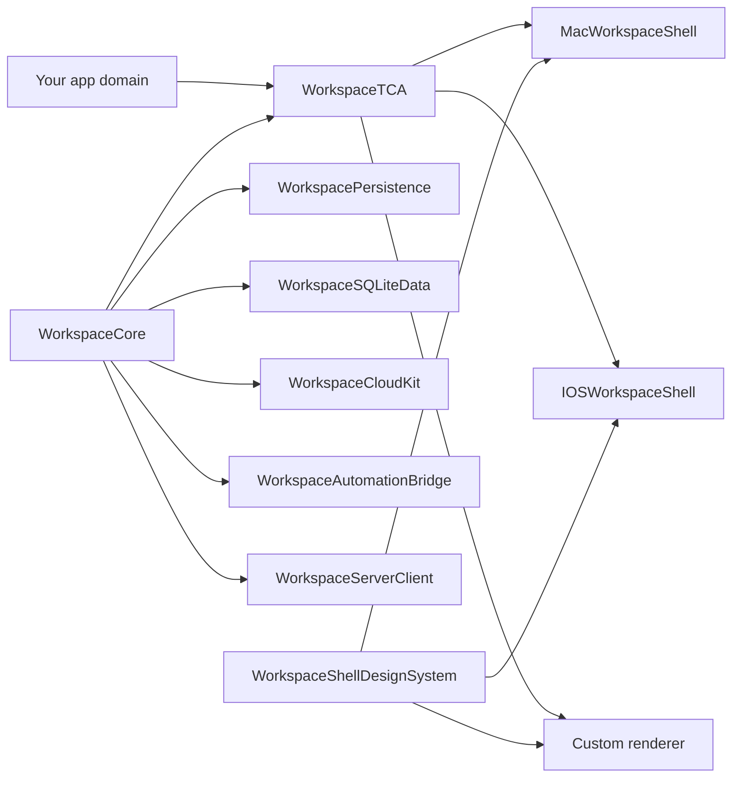

<div align="center">

# swift-workspace

<p>
  <strong>A reusable Swift workspace engine for Mac, iPhone, and iPad apps.</strong>
</p>

<p>
  Typed navigation, commands, restoration, platform shells, persistence adapters,
  automation descriptors, and optional companion server calls without tying your
  app to one renderer or storage backend.
</p>

<p>
  <a href="https://github.com/mrbagels/swift-workspace/actions/workflows/swift-workspace.yml">
    
  </a>
  <a href="https://swift.org">
    
  </a>
  <a href="Package.swift">
    
  </a>
  <a href="LICENSE">
    
  </a>
</p>

<p>
  <a href="Package.swift">
    
  </a>
  <a href="docs/operations/release-checklist.md">
    
  </a>
  <a href="https://github.com/pointfreeco/swift-composable-architecture">
    
  </a>
  <a href="docs/adoption/cloudkit.md">
    
  </a>
  <a href="docs/features/server-side-companion.md">
    
  </a>
  <a href="Sources/WorkspaceEngine/WorkspaceEngine.docc/WorkspaceEngine.md">
    
  </a>
</p>

<p>
  <a href="#install">Install</a> |
  <a href="#choose-your-path">Choose your path</a> |
  <a href="#quick-start">Quick start</a> |
  <a href="#architecture">Architecture</a> |
  <a href="#develop">Develop</a>
</p>

</div>

## Why This Exists

Productivity apps repeatedly rebuild the same foundation: route registries,
sidebars, split navigation, command palettes, native menus, keyboard shortcuts,
scene handoff, restoration, iCloud-aware persistence, automation entry points,
and server companion hooks.

`swift-workspace` makes that foundation shared, typed, testable, and
app-agnostic. Your app still owns domain state, documents, iCloud containers,
analytics, server decisions, and product-specific UI.

## What Ships

| Layer | What it gives you |
| --- | --- |
| Engine | Typed routes, commands, scenes, search, policy, diagnostics, restoration, pins, recents, and route states. |
| Reducer | `WorkspaceFeature`, shared TCA behavior, delegate effects, command execution, route opening, and registry reconciliation. |
| Shells | Custom macOS shell plus adaptive iPhone and iPad shells with command search, accessibility anchors, and visual fixtures. |
| Design system | Shared SwiftUI primitives for badges, keycaps, section labels, and route status states. |
| Persistence | JSON, UserDefaults, file storage, SQLiteData codecs, CloudKit contracts, and conflict policy values. |
| Automation | Serializable command catalog, shortcut descriptors, and App Intent handoff payloads. |
| Server | Optional Comet-backed client and test workflow for health, entitlements, templates, jobs, diagnostics, cassettes, replay, and contracts. |

## Install

Add the package in Xcode or SwiftPM:

```swift
.package(
  url: "https://github.com/mrbagels/swift-workspace",
  from: "0.1.0"
)
```

Then import only the products you need:

```swift
.product(name: "WorkspaceCore", package: "swift-workspace")
.product(name: "WorkspaceTCA", package: "swift-workspace")
.product(name: "MacWorkspaceShell", package: "swift-workspace")
.product(name: "IOSWorkspaceShell", package: "swift-workspace")
```

## Choose Your Path

| Goal | Start here | Add later |
| --- | --- | --- |
| Share typed navigation and commands | `WorkspaceCore` | `WorkspaceTCA` |
| Use the shared reducer in a TCA app | `WorkspaceTCA` | Platform shell products |
| Ship the bundled Mac shell | `MacWorkspaceShell` | `WorkspacePersistence`, `WorkspaceSQLiteData`, `WorkspaceCloudKit` |
| Ship iPhone and iPad shells | `IOSWorkspaceShell` | `WorkspaceAutomationBridge` |
| Build a fully custom renderer | `WorkspaceCore` plus `WorkspaceTCA` | `WorkspaceShellDesignSystem` |
| Add lightweight restoration | `WorkspacePersistence` | `WorkspaceSQLiteData` |
| Keep iCloud primary | `WorkspaceCloudKit` | App-owned CloudKit adapters |
| Expose Shortcuts or App Intents | `WorkspaceAutomationBridge` | Host app `AppIntent` types |
| Call a companion service | `WorkspaceServerClient` | `WorkspaceServerTesting` for fixtures and contracts |

## Product Map

| Product | Purpose |
| --- | --- |
| `WorkspaceCore` | Pure Swift route, command, scene, search, diagnostics, policy, state, and restoration vocabulary. |
| `WorkspaceTCA` | Platform-neutral reducer for route selection, command search, scenes, pins, recents, and restoration. |
| `WorkspaceEngine` | Convenience umbrella for the core engine products and TCA integration. |
| `WorkspacePersistence` | JSON, UserDefaults, and file-backed restoration helpers. |
| `WorkspaceSQLiteData` | Optional SQLiteData records, migrations, codecs, and metadata mapping. |
| `WorkspaceCloudKit` | Optional CloudKit record names, envelopes, conflict policies, and app-owned adapter contracts. |
| `WorkspaceShellDesignSystem` | SwiftUI badges, keycaps, section labels, and route status views shared by renderers. |
| `WorkspaceAutomationBridge` | Automation descriptors, shortcut metadata, and App Intent handoff payloads. |
| `WorkspaceServerClient` | Optional Comet client for companion service contracts. |
| `WorkspaceServerTesting` | Optional CometTesting helpers for server cassettes, replay, and contract reports. |
| `MacWorkspaceShell` | Custom macOS shell with sidebar styles, command palette, menus, toolbar, inspector, and scenes. |
| `IOSWorkspaceShell` | Adaptive iOS and iPadOS renderer with stack or split navigation, command search, pins, recents, and scene actions. |

## Quick Start

Define typed routes and a navigation registry:

```swift
import WorkspaceCore

enum AppRoute: String, Codable, Hashable, Sendable {
  case inbox
  case settings
}

let registry = WorkspaceNavigationRegistry(
  sections: [
    WorkspaceRouteSection(
      id: "workspace",
      title: "Workspace",
      routes: [
        WorkspaceRouteDescriptor(
          id: AppRoute.inbox,
          title: "Inbox",
          systemImage: "tray.full",
          badge: 12,
          shortcut: .command("1")
        ),
        WorkspaceRouteDescriptor(
          id: AppRoute.settings,
          title: "Settings",
          systemImage: "gearshape",
          contentState: .empty(
            title: "No Settings Changes",
            message: "Everything is already current.",
            systemImage: "gearshape"
          ),
          shortcut: .command(","),
          presentation: .fullWidth,
          scenePresentation: .singleton(id: "settings", title: "Settings")
        ),
      ]
    ),
  ],
  commands: [
    .appAction(
      id: "refresh-workspace",
      title: "Refresh Workspace",
      systemImage: "arrow.clockwise",
      shortcut: .command("r")
    ),
  ]
)
```

Wire the shared reducer into your app feature:

```swift
import ComposableArchitecture
import WorkspaceTCA

@Reducer
struct AppFeature {
  @ObservableState
  struct State: Equatable {
    var workspace = WorkspaceFeature<AppRoute>.State(
      navigation: registry,
      pinnedRouteIDs: [.inbox],
      selectedRouteID: .inbox
    )
  }

  enum Action: Sendable {
    case workspace(WorkspaceFeature<AppRoute>.Action)
  }

  var body: some Reducer<State, Action> {
    Scope(state: \.workspace, action: \.workspace) {
      WorkspaceFeature<AppRoute>()
    }

    Reduce { state, action in
      switch action {
      case .workspace(.delegate(.commandRequested(let commandID))):
        return runAppCommand(commandID)

      case .workspace(.delegate(.sceneRequested(let request))):
        return openScene(request)

      case .workspace:
        return .none
      }
    }
  }
}
```

Render the bundled Mac shell:

```swift
import MacWorkspaceShell

MacWorkspaceShellView(
  store: store.scope(state: \.workspace, action: \.workspace),
  configuration: MacWorkspaceShellConfiguration(
    title: "Workspace",
    sidebarPresentation: .floating
  )
) { route in
  AppRouteView(route: route)
}
```

Install native menus from the same command registry:

```swift
.commands {
  MacWorkspaceCommands(
    store: store.scope(state: \.workspace, action: \.workspace)
  )
}
```

Render the bundled iOS and iPadOS shell:

```swift
import IOSWorkspaceShell

IOSWorkspaceShellView(
  store: store.scope(state: \.workspace, action: \.workspace),
  configuration: IOSWorkspaceShellConfiguration(
    title: "Workspace",
    navigationStyle: .automatic
  )
) { route in
  AppRouteView(route: route)
}
```

## Architecture



Core and TCA stay platform-neutral. Platform shells consume the shared reducer,
but they do not become the engine. Optional products remain optional so a
consumer can adopt the pure engine without bringing in SQLiteData, CloudKit,
Comet, AppKit, or UIKit.

## Custom Renderers

You do not need the bundled shells. Custom clients can read directly from
`WorkspaceFeature.State`:

- `visibleSections`
- `pinnedRoutes`
- `recentRoutes`
- `selectedRoute`
- `filteredCommands`
- `recentCommands`
- `restorationState`

Dispatch shared actions back into the reducer:

- `.routeSelected(routeID)`
- `.routePinToggled(routeID)`
- `.recentRoutesCleared`
- `.commandPaletteCommandSelected(commandID)`
- `.routeOpenRequested(request)`
- `.routeMetadataPatchesApplied(patches)`

See [`Examples/CustomRendererClient`](Examples/CustomRendererClient) for a
compiled engine-only consumer.

## Optional Integrations

### iCloud-Primary Persistence

Workspace restoration is intentionally small. Persist it with:

- `WorkspacePersistence` for JSON, UserDefaults, and files.
- `WorkspaceSQLiteData` for database records and codecs.
- `WorkspaceCloudKit` for record contracts and conflict policy values.

iCloud remains primary for user-owned data. The package provides payload shapes
and adapter contracts. Your app owns the CloudKit container, subscriptions,
conflict UI, retries, and document data.

### App Intents And Shortcuts

`WorkspaceAutomationBridge` converts the shared command registry into:

- `WorkspaceAutomationCommandDescriptor`
- `WorkspaceAutomationHandoff`
- `WorkspaceAppShortcutDescriptor`

Host app targets bind those descriptors to concrete `AppIntent` and
`AppShortcutsProvider` types. This keeps App Intents thin and app-specific while
the command catalog remains shared.

### Server Companion

`WorkspaceServerClient` is optional and uses
[`Comet`](https://github.com/mrbagels/comet) `0.4.1` or newer. It provides typed
calls for:

- health,
- entitlements,
- templates,
- job submission and status,
- diagnostics upload,
- Comet activity and trace snapshots for diagnostics.

`WorkspaceServerTesting` layers CometTesting on top of the same client so test
targets can record cassettes, replay approved fixtures, promote cassettes to
strict contracts, and emit contract reports.

The server is a companion surface, not canonical storage. Keep documents,
workspace restoration, and user-owned data local or iCloud-primary.

## Examples And Docs

| Resource | Link |
| --- | --- |
| macOS demo app | [`Apps/MacWorkspaceDemo`](Apps/MacWorkspaceDemo) |
| iOS and iPadOS demo app | [`Apps/IOSWorkspaceDemo`](Apps/IOSWorkspaceDemo) |
| Minimal Mac starter | [`Examples/MinimalMacWorkspaceApp`](Examples/MinimalMacWorkspaceApp) |
| Minimal iOS starter | [`Examples/MinimalIOSWorkspaceApp`](Examples/MinimalIOSWorkspaceApp) |
| Custom renderer package | [`Examples/CustomRendererClient`](Examples/CustomRendererClient) |
| Mac shell quickstart | [`docs/adoption/mac-shell.md`](docs/adoption/mac-shell.md) |
| iOS shell quickstart | [`docs/adoption/ios-shell.md`](docs/adoption/ios-shell.md) |
| Engine-only quickstart | [`docs/adoption/engine-only.md`](docs/adoption/engine-only.md) |
| Custom renderer guide | [`docs/adoption/custom-renderer.md`](docs/adoption/custom-renderer.md) |
| Persistence guide | [`docs/adoption/persistence.md`](docs/adoption/persistence.md) |
| CloudKit guide | [`docs/adoption/cloudkit.md`](docs/adoption/cloudkit.md) |
| Automation guide | [`docs/adoption/automation.md`](docs/adoption/automation.md) |
| Server client guide | [`docs/adoption/server-client.md`](docs/adoption/server-client.md) |
| API stability review | [`docs/operations/api-stability-review-0.1.0.md`](docs/operations/api-stability-review-0.1.0.md) |

## Repository Layout

```text
Sources/                         Swift package products
Tests/                           Package tests and visual-state fixtures
Apps/MacWorkspaceDemo            macOS demo app
Apps/IOSWorkspaceDemo            iOS and iPadOS demo app
Examples/MinimalMacWorkspaceApp  Smallest macOS starter target
Examples/MinimalIOSWorkspaceApp  Smallest iOS starter target
Examples/CustomRendererClient    Engine-only custom renderer package
docs/adoption                    Consumer quickstarts
docs/architecture                Durable architecture docs
docs/features                    Feature briefs
docs/operations                  Verification, API review, release checklists
docs/product                     Roadmap and phased implementation plan
docs/technical                   Package map and implementation notes
```

## Develop

Generate the Xcode project:

```sh
xcodegen generate --spec project.yml
```

Run package tests:

```sh
swift test
```

Run the full local verification pass:

```sh
scripts/doctor.sh
scripts/check-docs.sh
scripts/verify.sh
```

Build iOS targets too:

```sh
VERIFY_BUILD_IOS=1 scripts/verify.sh
```

Run UI smoke tests:

```sh
VERIFY_RUN_UI_TESTS=1 scripts/verify.sh
VERIFY_BUILD_IOS=1 VERIFY_RUN_UI_TESTS=1 scripts/verify.sh
```

## Release

Initial public beta: `0.1.0`

Before tagging, run the release checklist and manually inspect the Mac and iOS
demos:

- [API review checklist](docs/operations/api-review-checklist.md)
- [0.1.0 API stability review](docs/operations/api-stability-review-0.1.0.md)
- [Release checklist](docs/operations/release-checklist.md)

## License

MIT. See [`LICENSE`](LICENSE).
